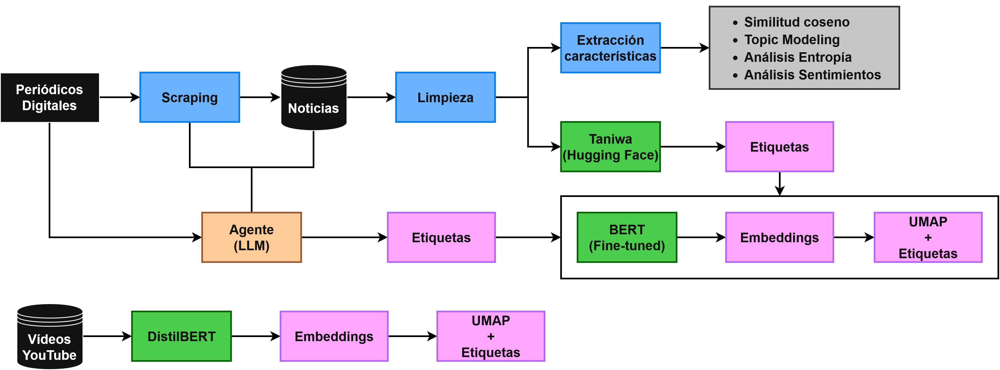

# Detección de *clickbait* en noticias
 
> **Proyecto de Procesado de Lenguaje Natural**  
> Máster en Ciencia de Datos - Universitat de València
 
**Autores:** Juan Alcaraz Otón, Xueyao An, Fabián Calvo Castillo, Adrián Carrasco Alcalá, Javier Herrero Pérez, Mario Martínez Guillén y Clara Montalvá Barcenilla

Curso 2025/2026
 
---

## Descripción
 
Este proyecto aborda la detección de *clickbait* en titulares y cuerpos de noticias en español mediante el uso de técnicas de Procesado de Lenguaje Natural (NLP). El *clickbait* es una estrategia de redacción que utiliza títulos sensacionalistas o engañosos para atraer clics, sin que el contenido del artículo justifique dicha expectativa.
 
El pipeline desarrollado combina técnicas de web scraping, Procesado de Lenguaje Natural y modelos de clasificación para etiquetar si un titular de noticia es o no *clickbait*, así como un agente de Inteligencia Artificial que automatiza este proceso. Se cubren los siguientes medios de comunicación españoles en tres categorías temáticas (internacional, nacional y cultura):

- ABC
- elDiario
- El Confidencial
- La Vanguardia
- 20minutos
- OkDiario
- RTVE
- Mediterráneo Digital
- El HuffPost

Adicionalmente, se realiza un análisis similar sobre un conjunto de vídeos de YouTube sobre las temáticas 11s, cambio climático y Covid etiquetados como *fake news* y no *fake news*.
 
---
 
## Estructura del repositorio
 
```
ProyectoNLP/
├── agente/                 # Agente de scraping de noticias
├── agente_clickbait/       # Agente de detección de clickbait
├── data/                   # Datos en bruto extraídos
├── data_processed/         # Datos procesados y etiquetados
├── data_youtube_raw/       # Datos en bruto extraídos de YouTube
├── img/                    # Imágenes y figuras del proyecto
├── notebooks/              # Notebooks de análisis y modelado
├── main.ipynb              # Notebook del informe con el pipeline completo
└── README.md
```
 
---

## Pipeline del proyecto
 

 
El pipeline completo consta de las siguientes etapas:
 
1. **Extracción de datos** — Scraping de noticias de los medios seleccionados.
2. **Preprocesado** — Limpieza, normalización y estructuración de los textos.
3. **Etiquetado** — Clasificación de los titulares como *clickbait* o no *clickbait*.
4. **Modelado** — Entrenamiento y evaluación de modelos de clasificación.
5. **Evaluación** — Análisis de métricas y comparación de enfoques.

Los notebooks con el código, los comentarios y los resultados de cada etapa se encuentran en la carpeta `notebooks/`.
